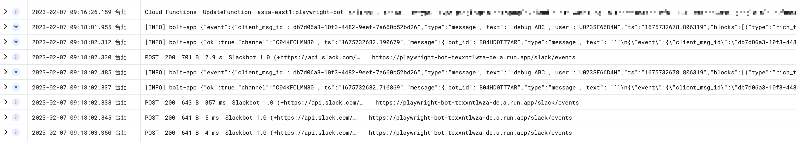
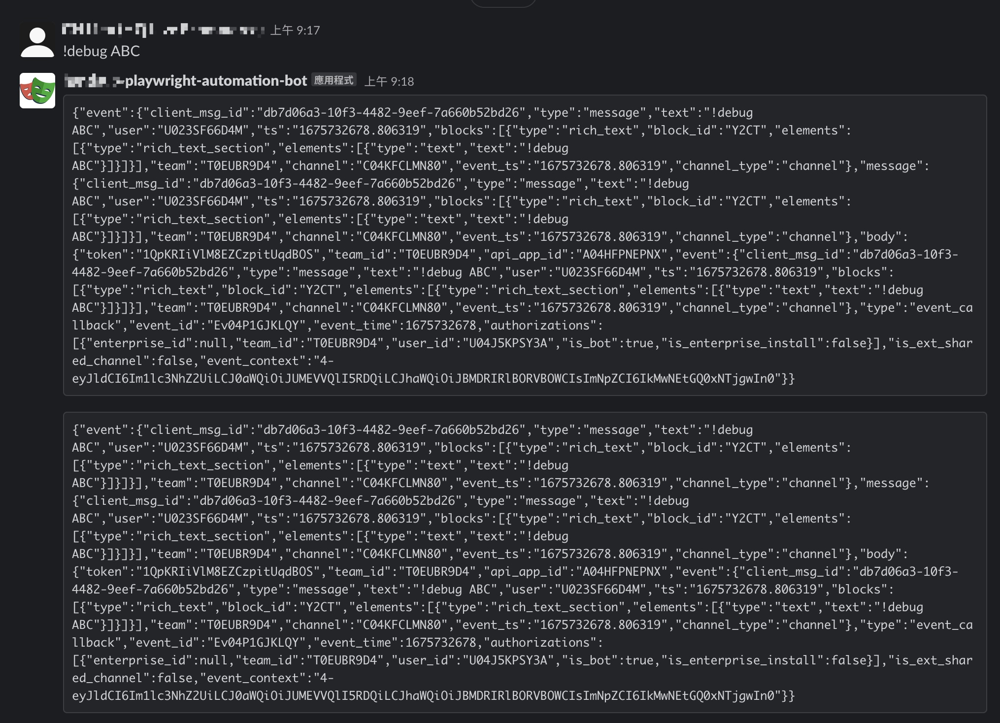

<!-- cSpell:ignore boltjs gcloud -->
# repro-slack-boltjs-duplicated-events




## Environments

Copy the `.env.example.yaml` to `.env.yaml` and fill in the following env:

### `SLACK_SECRET`

It's the `Signing Secret` in **Settings > Basic Information** in the bot page.

### `BOT_TOKEN`

It's the `Bot User OAuth Token` in **Features > OAuth & Permissions** in the bot page.

## Deploy

```sh
$ gcloud functions deploy --project="${PROJECT_NAME}" \
  "${SERVERLESS_FUNCTION_NAME}" \
  --gen2 \
  --region=asia-east1 \
  --runtime=nodejs16 \
  --entry-point=entry \
  --trigger-http \
  --env-vars-file .env.yaml \
  --allow-unauthenticated
```

Reference:

- [Installing the Google Cloud CLI Docker image](https://cloud.google.com/sdk/docs/downloads-docker)
- [Deploy a Cloud Function](https://cloud.google.com/functions/docs/deploy)
- [Slack Tutorial - Slash Commands (2nd gen)](https://cloud.google.com/functions/docs/tutorials/slack)
- [seratch/bolt-on-cloud-functions-for-firebase](https://github.com/seratch/bolt-on-cloud-functions-for-firebase)
